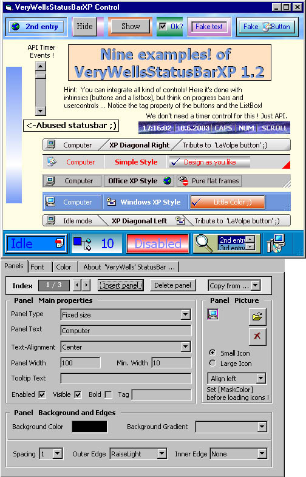

## VeryWellsStatusBarXP NEW\!  V\.1\.2c 9/9/2004

### Description

VeryWellsStatusBarXP Update to V. 1.2b

- More than a fine usercontrol statusbar in Windows XP, Office XP or much more looks! Very lot of advanced features,

also useable as a modern TOOLBAR! Have a look to the screenshot with nine examples and the

panels propertypage.

Include things like gradients and frames to panels, integration of all kind of controls and many more! We have autosize, spring to contents and alignment for text, alignment for panel pictures, more events, no more need for timer controls ...

Sorry for the bugs I did'nt find yet. Tell me and I will fix it soon. If you like my uc come back regulary for updates! 

----

New to V.1.2: * 'Bold'-Fontstyle for panels captions and * background pictures for the statusbar! (Now e can do things like skinning ... ). Some bug-fixes, finetuning and removing of no more used code (less is more ;) ) [UPDATE 1.2b: Bug fixes & changes to Pulic defs] 

----

UPDATE 1.2c: Fix with ToolTipProperty 

----

Regards

Light Templer

___=== BTW: VOTES are welcome and motivating ;) - Thanx! === 

----

 
### More Info
 

             |
---                |---
**Submitted On**   |2003-06-27 18:03:12
**By**             |[Light Templer](https://github.com/Planet-Source-Code/PSCIndex/blob/master/ByAuthor/light-templer.md)
**Level**          |Advanced
**User Rating**    |4.9 (209 globes from 43 users)
**Compatibility**  |VB 5\.0, VB 6\.0
**Category**       |[Custom Controls/ Forms/  Menus](https://github.com/Planet-Source-Code/PSCIndex/blob/master/ByCategory/custom-controls-forms-menus__1-4.md)
**World**          |[Visual Basic](https://github.com/Planet-Source-Code/PSCIndex/blob/master/ByWorld/visual-basic.md)
**Archive File**   |[VeryWellsS179126992004\.zip](https://github.com/Planet-Source-Code/light-templer-verywellsstatusbarxp-new-v-1-2c-9-9-2004__1-45877/archive/master.zip)

